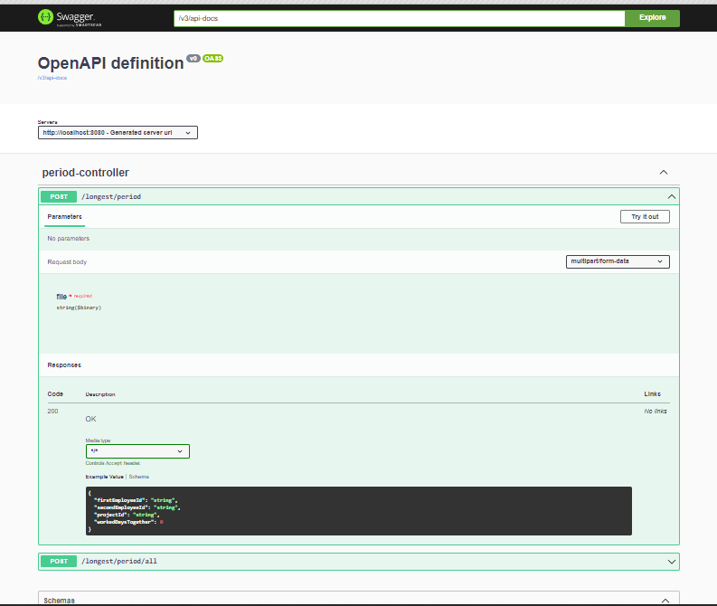

# Longest-period

Web application that identifies the pair of employees who have worked
together on common projects for the longest period of time. 

The data must be imported as a csv file in the following format:
EmpID, ProjectID, DateFrom, DateTo

## Features
- Calculating the pair with most overlapped work together
- Getting all Employee pairs who worked together

### Technical features
- Written on Java v17 with Spring v3
- Used Apache CSV common lib for reading csv files
- Using springdoc with OpenApi v3 for interacting with endpoints

## Screenshots

